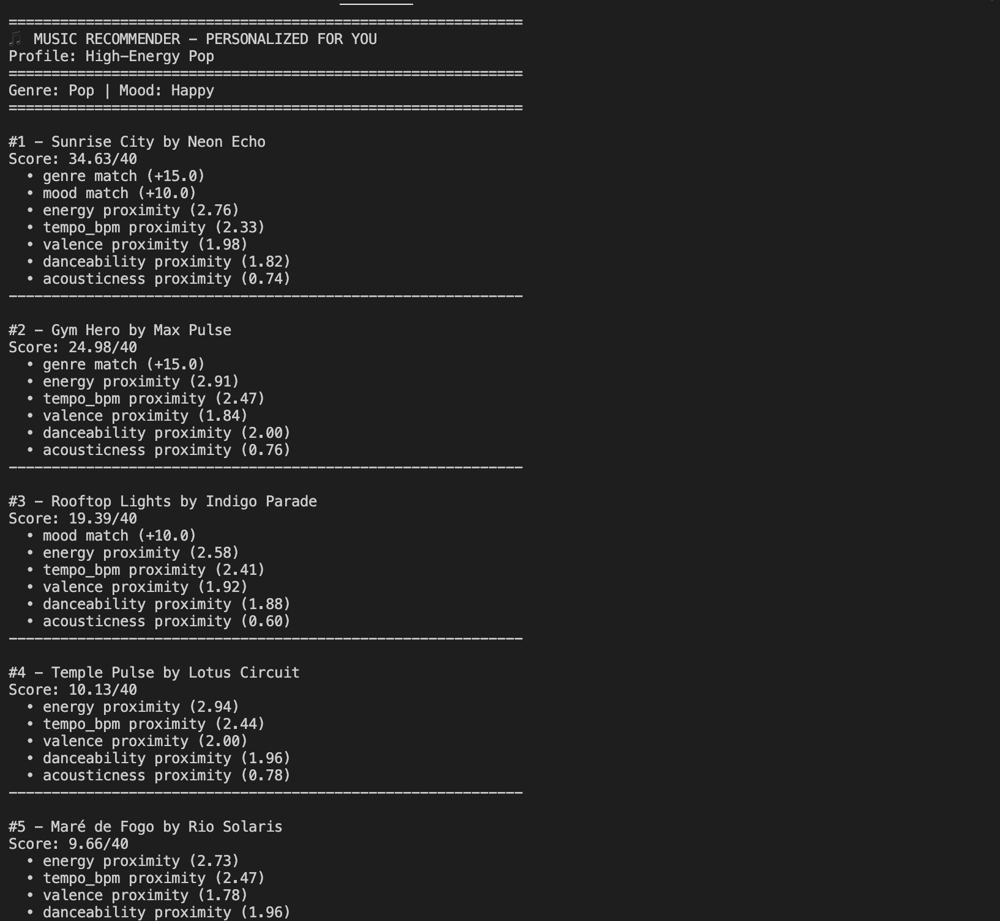
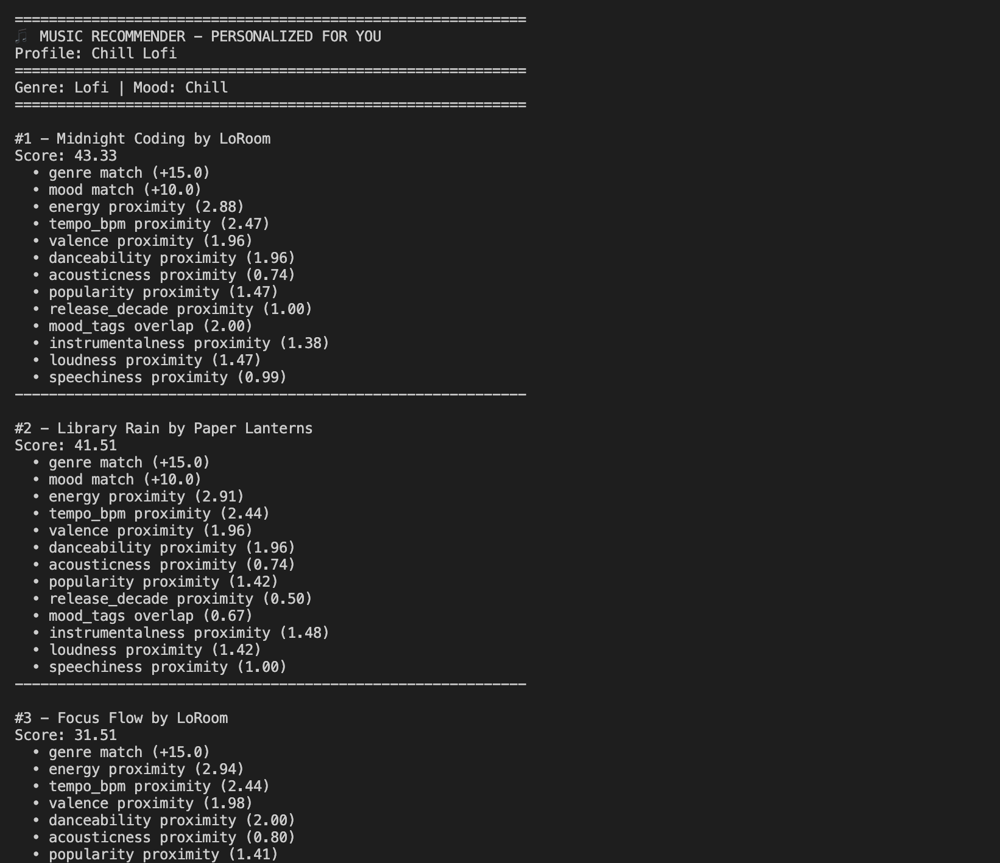
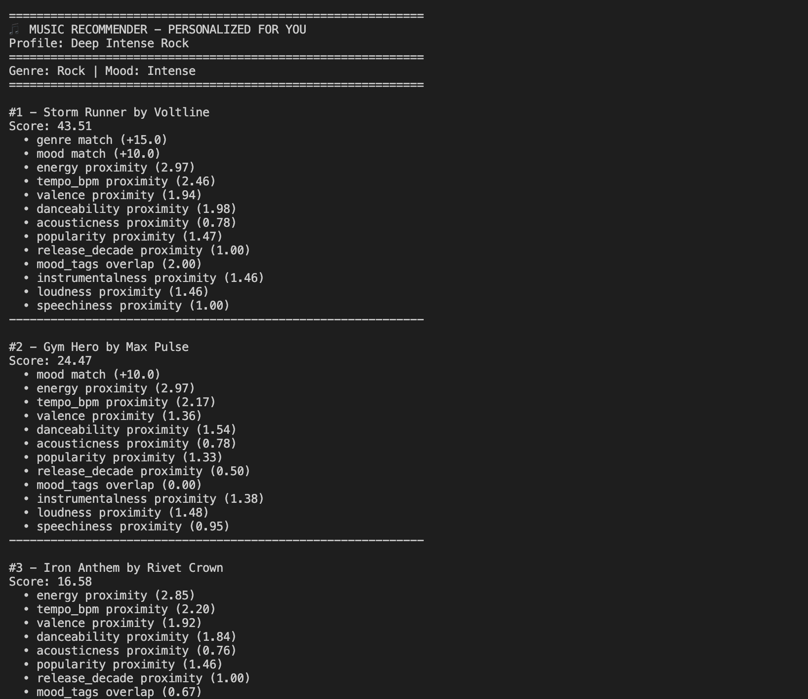
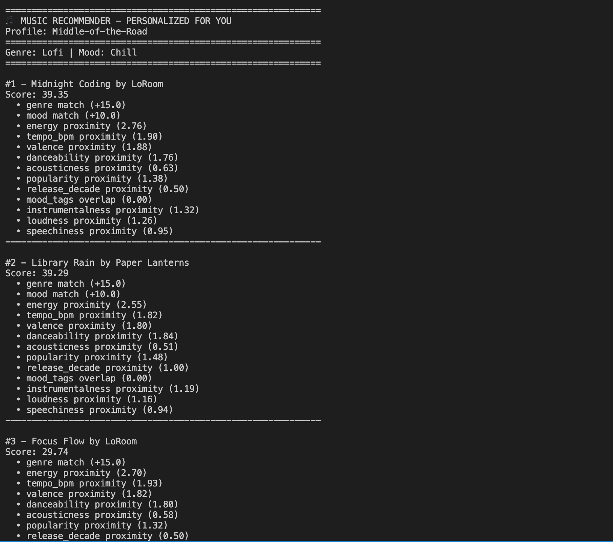

# 🎵 Music Recommender Simulation

## Project Summary

VibeFinder 1.0 is a content-based music recommender simulator built in Python. It loads a catalog of 18 songs, scores each one against a user's taste profile using weighted genre, mood, and audio feature matching, and returns a ranked list of personalized recommendations with explanations. This project explores how real-world platforms like Spotify turn song attributes and user preferences into predictions.

---

## How The System Works

<!-- Explain your design in plain language.

Some prompts to answer:

- What features does each `Song` use in your system
  - For example: genre, mood, energy, tempo
- What information does your `UserProfile` store
- How does your `Recommender` compute a score for each song
- How do you choose which songs to recommend

You can include a simple diagram or bullet list if helpful. -->

Real-world platforms like Spotify and YouTube Music primarily use two approaches: collaborative filtering, which infers taste from shared behavior across many users (plays, skips, playlist adds) without needing to know anything about the songs themselves, and content-based filtering, which compares song attributes like genre, mood, and energy against a user's known preferences to find the closest matches. This simulator uses a content-based approach — each song is scored by how closely its features align with a user's taste profile, and songs are ranked by that score to produce a personalized list.

**`Song` features:**

- `genre` — taste category (e.g., Pop, Lofi, Jazz)
- `mood` — emotional tone (e.g., Chill, Energetic, Sad)
- `energy` — intensity level (0.0–1.0)
- `tempo_bpm` — pace of the track in beats per minute
- `valence` — musical positivity (0.0–1.0)
- `danceability` — rhythmic suitability for dancing (0.0–1.0)
- `acousticness` — acoustic vs. electronic quality (0.0–1.0)

**`UserProfile` features:**

- `preferred_genre`, `preferred_mood` — categorical taste preferences
- `preferred_energy`, `preferred_tempo_bpm`, `preferred_valence`, `preferred_danceability`, `preferred_acousticness` — target numerical values the recommender scores each song against

### Algorithm Recipe

Each song is scored against the user profile using the following weights:

| Feature                | Type        | Points                            |
| ---------------------- | ----------- | --------------------------------- |
| Genre match            | Categorical | +15                               |
| Mood match             | Categorical | +10                               |
| Energy proximity       | Numerical   | 3.0 × (1 - \|user − song\|)       |
| Tempo proximity        | Numerical   | 2.5 × (1 - \|user − song\| / 176) |
| Valence proximity      | Numerical   | 2.0 × (1 - \|user − song\|)       |
| Danceability proximity | Numerical   | 2.0 × (1 - \|user − song\|)       |
| Acousticness proximity | Numerical   | 0.8 × (1 - \|user − song\|)       |

**Maximum possible score: ~40 points.** Songs are ranked by total score and the top-K results are returned as recommendations.

### Expected Bias

Because genre and mood together account for up to 25 out of 40 possible points, this system may over-prioritize categorical matches — a song with the right genre and mood but poor numerical alignment could outrank a song that is a near-perfect numerical match in a different genre. Additionally, acousticness carries the lowest weight intentionally, meaning highly produced songs are not unfairly penalized for lacking acoustic qualities.

## Getting Started

### Setup

1. Create a virtual environment (optional but recommended):

   ```bash
   python -m venv .venv
   source .venv/bin/activate      # Mac or Linux
   .venv\Scripts\activate         # Windows

   ```

2. Install dependencies

```bash
pip install -r requirements.txt
```

3. Run the app:

```bash
python -m src.main
```

### Running Tests

Run the starter tests with:

```bash
pytest
```

You can add more tests in `tests/test_recommender.py`.

---

## Experiments You Tried

<!-- Use this section to document the experiments you ran. For example:

- What happened when you changed the weight on genre from 2.0 to 0.5
- What happened when you added tempo or valence to the score
- How did your system behave for different types of users -->

I tested four user profiles (High-Energy Pop, Chill Lofi, Deep Intense Rock, and Middle-of-the-Road) and ran a weight experiment doubling energy and halving genre. The weight change caused ranking shifts in the High-Energy Pop profile, confirming the system is sensitive to weight decisions. The Middle-of-the-Road profile revealed a filter bubble — neutral numerical preferences still defaulted to the same lofi/chill results as the specific Chill Lofi profile.

### Profile Test Results






---

## Limitations and Risks

<!-- Summarize some limitations of your recommender.

Examples:

- It only works on a tiny catalog
- It does not understand lyrics or language
- It might over favor one genre or mood

You will go deeper on this in your model card. -->

VibeFinder 1.0 operates on a small catalog of 18 songs, which limits recommendation variety — especially for users whose preferred genre appears only once in the dataset. The system does not consider lyrics, language, cultural context, or listening history, and it can only match one genre and one mood at a time. Because genre and mood bonuses together outweigh all numerical features combined, the system tends to create a filter bubble, repeatedly recommending the same genre rather than surfacing unexpected but relevant songs. See the [Model Card](model_card.md) for a full breakdown of limitations and bias.

---

## Reflection

<!-- Read and complete `model_card.md`: -->

[**Model Card**](model_card.md)

<!-- Write 1 to 2 paragraphs here about what you learned:

- about how recommenders turn data into predictions
- about where bias or unfairness could show up in systems like this -->

Building this recommender made it clear that turning data into predictions is fundamentally about design choices — not just math. Every weight assigned to a feature is a decision about what matters most to a user, and those decisions have real consequences. A genre weight of 15 points versus 7.5 points is not just a number change; it determines whether the system serves a user who wants to explore new sounds or one who wants more of the same.

Bias in a system like this does not always look like an obvious mistake — it often looks like a reasonable simplification. Treating genre as a fixed, single-valued preference feels logical, but it immediately fails users with diverse taste. Representing a catalog with one metal song and three lofi songs feels neutral, but it quietly disadvantages anyone who listens to metal. These patterns mirror how real-world AI systems can appear fair on the surface while systematically underserving certain groups.
