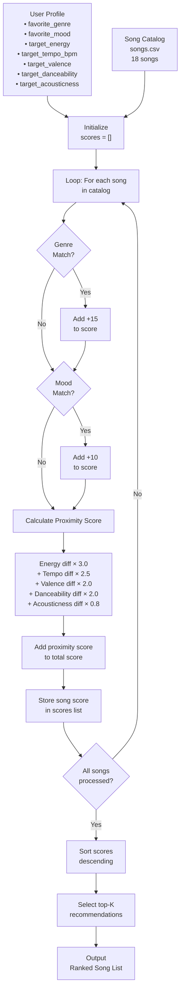

```mermaid
flowchart TD
    A["User Profile<br/>• favorite_genre<br/>• favorite_mood<br/>• target_energy<br/>• target_tempo_bpm<br/>• target_valence<br/>• target_danceability<br/>• target_acousticness"]
    B["Song Catalog<br/>songs.csv<br/>18 songs"]

    C["Initialize<br/>scores = []"]

    D["Loop: For each song<br/>in catalog"]

    E{"Genre<br/>Match?"}
    F["Add +15<br/>to score"]

    G{"Mood<br/>Match?"}
    H["Add +10<br/>to score"]

    I["Calculate Proximity Score"]
    J["Energy diff × 3.0<br/>+ Tempo diff × 2.5<br/>+ Valence diff × 2.0<br/>+ Danceability diff × 2.0<br/>+ Acousticness diff × 0.8"]

    K["Add proximity score<br/>to total score"]

    L["Store song score<br/>in scores list"]

    M{"All songs<br/>processed?"}

    N["Sort scores<br/>descending"]

    O["Select top-K<br/>recommendations"]

    P["Output<br/>Ranked Song List"]

    A --> C
    B --> C
    C --> D
    D --> E
    E -->|Yes| F
    E -->|No| G
    F --> G
    G -->|Yes| H
    G -->|No| I
    H --> I
    I --> J
    J --> K
    K --> L
    L --> M
    M -->|No| D
    M -->|Yes| N
    N --> O
    O --> P
```
